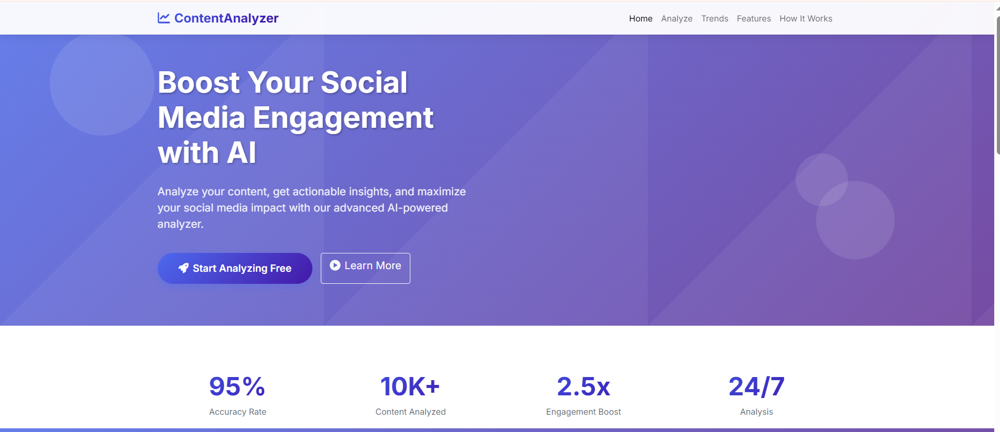

# Social Media Content Analyzer

### Demo Video
Watch the working demo of **Social Media Content Analyzer** here:  

Powerful AI-driven tool to analyze text extracted from PDFs & Images, providing engagement score, sentiment analysis, readability metrics, word cloud, trending topics, platform-wise optimization, hashtags & more.

🔗 Live Demo (Render):
👉 https://socialmediacontentanalyzerrrr.onrender.com/

⚠️ Render takes 1–2 minutes to load the first time (cold start). Please wait.

📌 Features

✔ Extract text from PDF, PNG, JPG, JPEG
✔ OCR support via OCR.Space API
✔ Engagement analysis (score, sentiment, readability, structure, keywords)
✔ Word frequency graph & Word Cloud
✔ Social media platform-wise analysis: Twitter, Instagram, Facebook, LinkedIn
✔ Automatic Hashtag Generation
✔ Category detection (Tech, Business, Lifestyle, Education, etc.)
✔ Trending topics (Twitter, Google, Instagram, LinkedIn – mock data)
✔ Clean modern UI with responsive templates
✔ Fully database-free, easy to deploy on Render
✔ Temporary storage using tempfile (safe, auto-cleanup)

📁 Project Structure
SocialMediaContentAnalyzerrrr/
│── app.py
│── requirements.txt
│── templates/
│     ├── index.html
│     ├── upload.html
│     ├── results.html
│     └── trends.html
│── static/
│     ├── css/
│     ├── js/
│     └── assets/
│── README.md
│── .env (optional - SECRET_KEY)

🚀 Live Demo

🔗 https://socialmediacontentanalyzerrrr.onrender.com/

⚠️ Takes 1–2 min on first load due to Render free tier.

🛠️ Tech Stack

Python (Flask)

HTML, CSS, JavaScript

OCR.Space API

NLTK

TextBlob

Matplotlib

WordCloud

NumPy

tempfile + shutil for secure file handling

🧠 Core Functionalities Overview
🔍 1. Text Extraction

PDF → PyPDF2

Images → OCR.Space API

📊 2. Engagement Analysis

Includes:

Sentiment score

Word count, sentence count

Unique words

Engagement Score (0–100)

Auto suggestions to improve content

🌀 3. Word Cloud + Word Frequency Chart

High-quality PNG generated using Matplotlib & WordCloud

📚 4. Advanced Analytics

Flesch Reading Ease

SMOG Index

Coleman-Liau Index

Average sentence length

Lexical diversity

Much more…

🏷️ 5. Hashtag Generation

Based on:

Topic

Keywords

Category detection

📈 6. Social Media Platform Breakdown

Each platform includes:

Ideal post length

Post score

Suggestions

Visual indicators

📦 Installation (Local Setup)
1. Clone the repository
git clone https://github.com/riteshbhai70/SocialMediaContentAnalyzerrrr.git
cd SocialMediaContentAnalyzerrrr

2. Install dependencies
pip install -r requirements.txt

3. (Optional) Add .env
SECRET_KEY=your_secret_key

4. Run the App
python app.py

Access at:
➡ http://localhost:5000

☁️ Deploy on Render (Free)

Already deployed here:
👉 https://socialmediacontentanalyzerrrr.onrender.com/

To deploy yourself:

Connect GitHub repo

Select Build Command:

pip install -r requirements.txt

Start Command:

gunicorn app:app

Add environment variable:

SECRET_KEY = your_key

👨‍💻 Developed By

Ritesh Kumar
🌐 GitHub: https://github.com/riteshbhai70

💼 Portfolio (if any): Add here
📧 Email: 

⭐ Support This Project

If this project helped you, please 💙 star the repository!

👉 Star Now:
https://github.com/riteshbhai70/SocialMediaContentAnalyzerrrr
 ⭐

📜 License

This project is licensed under the MIT License – free to use, modify, and distribute.

AI-powered content suggestions using GPT models.

Export results to PDF or CSV.

Mobile-friendly UI improvements.

